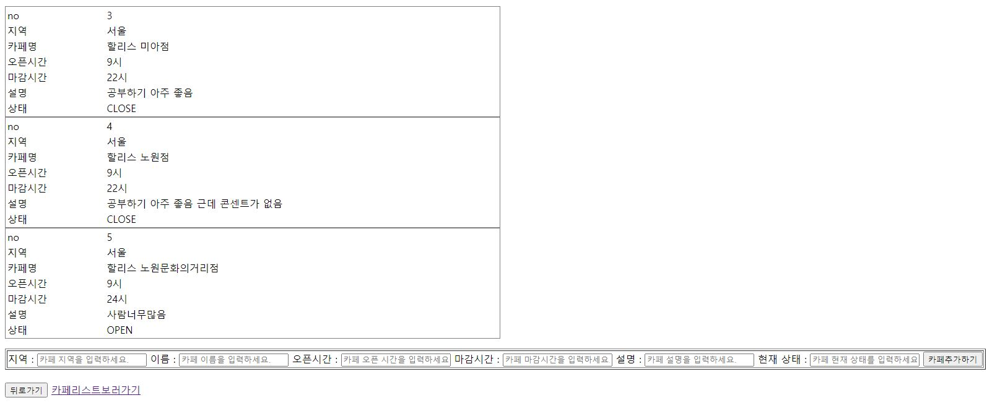
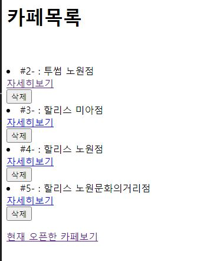
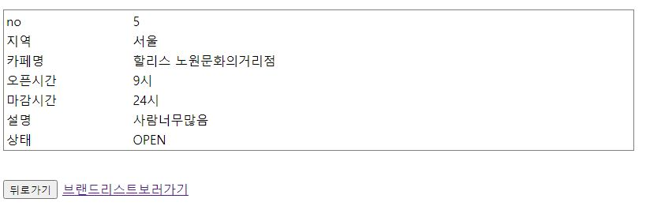

# 202112701 손채연
# 카페 현황 API

## BASE URL

http://ec2-54-180-68-123.ap-northeast-2.compute.amazonaws.com:3000/


## 😎시작

``` 
npm i
```

##  🚴 ROUTER List

|       항목            |          URL           | Method  |
| :--------------------:| :--------------------: | :----: |
|[전체 브랜드 보기 (ejs로 구현)](#전체-브랜드-보기)      |        /brand/brandlist        |  GET   |
|[브랜드 내 카페목록 보기 (ejs로 구현)](#브랜드-내-카페목록-보기)|      /brand/brandcafelist/:brandId      |  GET   |
|[브랜드 추가 (ejs로 구현)](#브랜드-추가)          |      /brand/brandinsert       |  POST   |
|[브랜드 수정 (ejs로 구현)](#브랜드-수정)       |    /brand/brandupdate/:brandId    |  PUT   |
|[브랜드 삭제 (ejs로 구현)](#브랜드-삭제)       |    /brand/branddelete/:brandId    |  DELETE   |
|[전체 카페 보기 (ejs로 구현)](#전체-카페-보기)        |    /cafe/cafelist     |  GET   |
|[카페 상세보기(ejs로 구현)](#카페-상세보기)          | /cafe/cafedetail/:cafeId |  GET   |
|[현재 오픈한 카페 보기(ejs로 구현)](#현재-오픈한-카페-보기)  |        /cafe/cafeopenList       |  GET  |
|[카페 추가(ejs로 구현)](#카페-추가)             |   /cafe/cafeinsert/:brandId    |  POST  |
|[카페 상태 수정](#카페-상태-수정)|   /cafe/cafestatusupdate/:cafeId    |  PUT  |
|[카페 삭제(ejs로 구현)](#카페-삭제)              |   /cafe/cafedelete/:cafeId     |  DELETE  |


---

### 📄전체 브랜드 보기 (ejs로 구현)


#### example URL

```
http://ec2-54-180-68-123.ap-northeast-2.compute.amazonaws.com:3000/brand/brandlist
```

#### 요청

|      항목   |  설명|
| :---------: | ---------------- |
|     URL     | /brand/brandlist        |
|   URL 예    | /brand/brandlist         |
| 요청 메소드 | GET              |

---

### 📄브랜드 내 카페목록 보기 (ejs로 구현)



#### example URL

```
http://ec2-54-180-68-123.ap-northeast-2.compute.amazonaws.com:3000/brand/brandcafelist/3
```

#### 요청

|      항목   |  설명|
| :---------: | ---------------- |
|     URL     | /brand/brandcafelist/:brandId        |
|   URL 예    | /brand/brandcafelist/3         |
| 요청 메소드 | GET              |

---

### 📄브랜드 추가 (ejs로 구현)


#### example URL

```
http://ec2-54-180-68-123.ap-northeast-2.compute.amazonaws.com:3000/brand/brandinsert
```

#### 요청

|      항목   |  설명|
| :---------: | ---------------- |
|     URL     | /brand/brandinsert        |
|   URL 예    | /brand/brandinsert         |
| 요청 메소드 | POST              |

##### Request 예(메세지 타입 : JSON)

```
{
    "brand":"스타벅스"
}
```

---

### 📄브랜드 수정 (ejs로 구현)


#### example URL

```
http://ec2-54-180-68-123.ap-northeast-2.compute.amazonaws.com:3000/brand/brandupdate/3
```

#### 요청

|      항목   |  설명|
| :---------: | ---------------- |
|     URL     | /brand/brandupdate/:brandId        |
|   URL 예    | /brand/brandupdate/3         |
| 요청 메소드 | PUT              |

##### Request 예(메세지 타입 : JSON)

```
{
    "brand":"투썸플레이스"
}
```

------

### 📄브랜드 삭제 (ejs로 구현)


#### example URL

```
http://ec2-54-180-68-123.ap-northeast-2.compute.amazonaws.com:3000/brand/branddelete/3
```

#### 요청

|      항목   |  설명|
| :---------: | ---------------- |
|     URL     | /brand/branddelete/:brandId        |
|   URL 예    | /brand/branddelete/3         |
| 요청 메소드 | DELETE             |

---

### 📄전체 카페 보기 (ejs로 구현)



#### example URL

```
http://ec2-54-180-68-123.ap-northeast-2.compute.amazonaws.com:3000/cafe/cafelist
```

#### 요청

|      항목   |  설명|
| :---------: | ---------------- |
|     URL     | /cafe/cafelist        |
|   URL 예    | /cafe/cafelist         |
| 요청 메소드 | GET              |

---
### 📄카페 상세보기 (ejs로 구현)



#### example URL

```
http://ec2-54-180-68-123.ap-northeast-2.compute.amazonaws.com:3000/cafe/cafedetail/1
```

#### 요청

|      항목   |  설명|
| :---------: | ---------------- |
|     URL     | /cafe/cafedetail/:cafeId       |
|   URL 예    | /cafe/cafedetail/1        |
| 요청 메소드 | GET              |

##### Response 메세지 예

```
[
    {
        "id": 1,
        "location": "서울",
        "name": "투썸 하계점",
        "operatingtimeS": 9,
        "operatingtimeE": 22,
        "content": "내용내용",
        "status": "OPEN",
        "createdAt": "2021-06-20T14:34:22.000Z",
        "updatedAt": "2021-06-20T14:34:22.000Z",
        "brandId": 3
    }
]
```

---
### 📄현재 오픈한 카페 보기 (ejs로 구현)


#### example URL

```
http://ec2-54-180-68-123.ap-northeast-2.compute.amazonaws.com:3000/cafe/cafeopenlist
```

#### 요청

|      항목   |  설명|
| :---------: | ---------------- |
|     URL     | /cafe/cafeopenlist       |
|   URL 예    | /cafe/cafeopenlist       |
| 요청 메소드 | GET              |

##### Response 메세지 예

```
[
    {
        "id": 1,
        "location": "서울",
        "name": "투썸 하계점",
        "operatingtimeS": 9,
        "operatingtimeE": 22,
        "content": "내용내용",
        "status": "OPEN",
        "createdAt": "2021-06-20T14:34:22.000Z",
        "updatedAt": "2021-06-20T14:34:22.000Z",
        "brandId": 3
    }
]
```

---
### 📄카페 추가 (ejs로 구현)


#### example URL

```
http://ec2-54-180-68-123.ap-northeast-2.compute.amazonaws.com:3000/cafe/cafeinsert/2
```

#### 요청

|      항목   |  설명|
| :---------: | ---------------- |
|     URL     | /cafe/cafeinsert/:brandId       |
|   URL 예    | /cafe/cafeinsert/2       |
| 요청 메소드 | POST              |

##### Request 예(메세지 타입 : JSON)

```
{
    "location" : "서울",
    "name" : "할리스 미아점",
    "operatingtimeS" : 9,
    "operatingtimeE" : 22,
    "content" : "공부하기 아주 좋음",
    "status" : "CLOSE"
}
```

##### Response 메세지 예

```
{
    "location" : "서울",
    "name" : "할리스 미아점",
    "operatingtimeS" : 9,
    "operatingtimeE" : 22,
    "content" : "공부하기 아주 좋음",
    "status" : "CLOSE"
}
```

---
### 📄카페 상태 수정

#### example URL

```
http://ec2-54-180-68-123.ap-northeast-2.compute.amazonaws.com:3000/cafe/cafestatusupdate/2
```

#### 요청

|      항목   |  설명|
| :---------: | ---------------- |
|     URL     | /cafe/cafestatusupdate/:cafeId       |
|   URL 예    | /cafe/cafestatusupdate/2       |
| 요청 메소드 | PUT              |

##### Request 예(메세지 타입 : JSON)

```
{
    "status":"CLOSE"
}
```

##### Response 메세지 예

```
카페 상태 수정 성공
```

---
### 📄카페 삭제 (ejs로 구현)


#### example URL

```
http://ec2-54-180-68-123.ap-northeast-2.compute.amazonaws.com:3000/cafe/cafedelete/1
```

#### 요청

|      항목   |  설명|
| :---------: | ---------------- |
|     URL     | /cafe/cafedelete/:cafeId       |
|   URL 예    | /cafe/cafedelete/1       |
| 요청 메소드 | DELETE              |

- - -
- - -
- - -

#### 데이터베이스 설계

###### Table name

Brands

###### Column

id / INT(11) / primary Key, Auto Increment<br/>
brand / VARCHAR(100) / unique key<br/>

- - -

###### Table name

Cafes

###### Column

id / INT(11) / primary Key, Auto Increment<br/>
location / VARCHAR(100)<br/>
name / VARCHAR(100)<br/>
operatingtimeS / INT(11)<br/>
operatingtimeE / INT(11)<br/>
content / VARCHAR(100)<br/>
status / VARCHAR(100)<br/>
createAt / DATETIME<br/>
updatedAt / DATETIME<br/>
brandId / INT(11) / foreign Key<br/>

Brands : Cafes => 1:N 관계